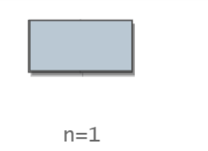
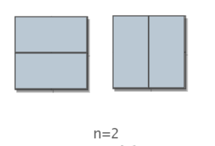

#  题目描述

我们可以用2*1的小矩形横着或者竖着去覆盖更大的矩形。请问用n个2*1的小矩形无重叠地覆盖一个2*n的大矩形，总共有多少种方法？

#  思路解析

做此类型题目先举例 找出特殊规律  抽象成公式解答

当 n = 1 时, 矩形只有一种摆放方法  横着放   即f(1) = 1;



当 n = 2 时, 矩形有两种摆放方法, 两个小矩形横着放 或者两个一起竖着放 即f(2) = 2;

 

当 n = 3 时, 先考虑第一块怎么放 

如果横着放 则剩下2*2的区域 即f(2)

如果竖着放 则剩下 2*1的区域 即f(1)

所以f(3) = f(1) + (2)

根据规律总结出

n = 1 , f(n) = 1

n = 2 , f(2) = 2

n >= 3 , f(n) = f(n - 1) + f(n - 2)

发现是斐波那契数列


#  代码展示
```java
public class Solution {
    public int RectCover(int target) {
        if(target <= 2) {
            return target;
        }
        int pre1 = 1; int pre2 = 2; 
        int result = 0;
        for(int i = 3; i <= target; i++) {
            result = pre1 + pre2;
            pre1 = pre2;
            pre2 = result;
        }
        return  result;
    }
}
```
