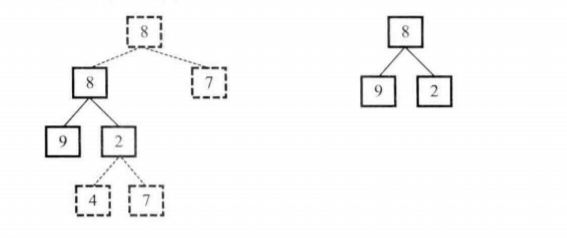

#  题目描述

输入两棵二叉树A，B，判断B是不是A的子结构。（ps：我们约定空树不是任意一个树的子结构）

#  思路解析



 首先分两步做

- 1.在树A中找到与树B根节点相同的节点R

- 2.判断树A以R为根节点的子树是不是包含树B


#  代码展示
```java
/**
public class TreeNode {
    int val = 0;
    TreeNode left = null;
    TreeNode right = null;

    public TreeNode(int val) {
        this.val = val;

    }

}
*/
public class Solution {
    //在树A找到树B的根节点
    public boolean HasSubtree(TreeNode root1,TreeNode root2) {
        boolean result = false;
        if (root1 != null && root2 != null){
            if (root1.val == root2.val) {
                result = DoesTree1HaveTree2(root1,root2);
            }
            if(!result) {
                result = HasSubtree(root1.left,root2);
            }
            if(!result) {
                result = HasSubtree(root1.right,root2);
            }
        }
        return result;
    }

    //在树A找到树B的子结构
    public boolean DoesTree1HaveTree2(TreeNode root1,TreeNode root2){
        //树A先遍历完 则不存在子结构
        if (root1 == null && root2 != null) return false;
        //判断树B是否遍历完成
        if (root2 == null) return true;
        if (root1.val != root2.val) return false;
        return DoesTree1HaveTree2(root1.left,root2.left) && DoesTree1HaveTree2(root1.right,root2.right);
    }
}
```
# 考察要点

二叉树遍历

代码的鲁棒性