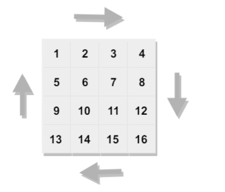

#  题目描述

输入一个矩阵，按照从外向里以顺时针的顺序依次打印出每一个数字

例如，如果输入如下4 X 4矩阵： 1 2 3 4 5 6 7 8 9 10 11 12 13 14 15 16 则依次打印出数字1,2,3,4,8,12,16,15,14,13,9,5,6,7,11,10.



#  思路解析


考虑上下左右遍历的情景，注意遍历的边界

#  代码展示

```java
import java.util.ArrayList;
public class Solution {
    public ArrayList<Integer> printMatrix(int[][] matrix) {
        ArrayList<Integer> ret = new ArrayList<>();
        int r1 = 0, r2 = matrix.length - 1, c1 = 0, c2 = matrix[0].length - 1;
        while (r1 <= r2 && c1 <= c2) {
            //从左到右
            for (int i = c1; i <= c2; i++)
                ret.add(matrix[r1][i]);
            //从上到下
            for (int i = r1 + 1; i <= r2; i++)
                ret.add(matrix[i][c2]);
            //从右到左 
            if (r1 != r2)
                for (int i = c2 - 1; i >= c1; i--)
                    ret.add(matrix[r2][i]);
            //从下到上
            if (c1 != c2)
                for (int i = r2 - 1; i > r1; i--)
                    ret.add(matrix[i][c1]);
            //边界处理
            r1++; r2--; c1++; c2--;
        }
        return ret;
    }
}

```

#  考察要点


