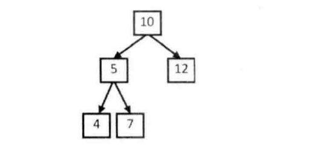

#  题目描述

输入一颗二叉树的根节点和一个整数，打印出二叉树中结点值的和为输入整数的所有路径。路径定义为从树的根结点开始往下一直到叶结点所经过的结点形成一条路径。

如下二叉树和输入和为 22


#  思路解析

1.遍历    递归遍历二叉树,将路径上的值存进`Path`集合中,直到叶子为止，判断集合的和与`target`是否相等

2.回溯    如果相等,将`path`加入结果集中,去掉`path`中最后一个元素     如果不相等,也去掉`path`中最后一个元素,继续遍历

#  代码展示
```java
import java.util.ArrayList;
/**
public class TreeNode {
    int val = 0;
    TreeNode left = null;
    TreeNode right = null;

    public TreeNode(int val) {
        this.val = val;

    }

}
*/
public class Solution {
    ArrayList<ArrayList<Integer>> paths = new ArrayList<ArrayList<Integer>>();
    ArrayList<Integer> path = new ArrayList<Integer>();
    public ArrayList<ArrayList<Integer>> FindPath(TreeNode root,int target) {
        if (root == null) {
            return paths;
        } 
        findPath(root,target);
        return paths;
    }
    
    public void findPath(TreeNode root, int target) {
        path.add(root.val);
       
        if (target == root.val && root.left == null && root.right == null){
            paths.add(new ArrayList(path));
        }
        if (root.left != null) {
            findPath(root.left,  target - root.val);
        }
        if (root.right != null) {
            findPath(root.right,  target - root.val);
        }
        path.remove(path.size() - 1);
        return;
    }
}

```


