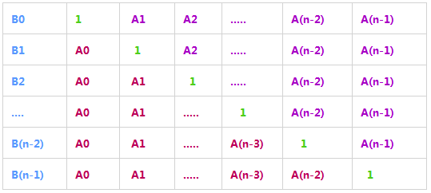

#  题目描述

给定一个数组A[0,1,...,n-1],请构建一个数组B[0,1,...,n-1],其中B中的元素B[i]=A[0]*A[1]*...*A[i-1]*A[i+1]*...*A[n-1]。不能使用除法。
#  思路解析

题目的意思是对于任意一个 B[i] 等于 A 中所有元素的乘积除以 A[i] 但是不能用除法

如果暴力遍历乘积，每一次遍历的结果在下一次遍历中不能重复使用，就会导致时间复杂度为 O(n^2)

所以考虑到计算每个B[i]时都会有重复，思考B[i]之间的联系，找出规律，提高效率。



由上图可知，A[i]左边与A[i]右边具有重复性的规律，所以我们先从左到右遍历到A[i]一次，然后在从右到左遍历到A[i]一次 

#  代码展示

```java
import java.util.ArrayList;
public class Solution {
    public int[] multiply(int[] A) {
        int n = A.length;
        int[] B = new int[n];
        for (int i = 0, product = 1; i < n; product *= A[i], i++)       /* 从左往右累乘 */
            B[i] = product;
        for (int i = n - 1, product = 1; i >= 0; product *= A[i], i--)  /* 从右往左累乘 */
            B[i] *= product;
        return B;
    }
}
```