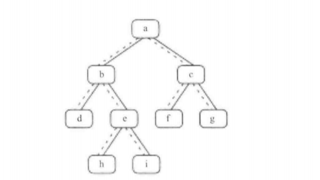

#  题目描述

给定一个二叉树和其中的一个结点，请找出中序遍历顺序的下一个结点并且返回。注意，树中的结点不仅包含左右子结点，同时包含指向父结点的指针。#  思路解析



#  思路解析

- 先分析具体情况  中序遍历:左根右
- 如果当前节点有右子树 如 e 节点，根据中序遍历则要找到最左节点 h
- 当前节点没有右子树，分为两种情况 h 和 i 
- h 情况为父节点的左子树，根据‘左根右’，下一个改遍历根节点（父节点） 即为 e 
- i 情况为父节点的右子树，，根据‘左根右’，~~下一个改遍历左节点，~~ 向上找到第一个 当前节点等于父节点的左结点  输出当前节点的父节点的值 a


#  代码展示

```java
/*
public class TreeLinkNode {
    int val;
    TreeLinkNode left = null;
    TreeLinkNode right = null;
    TreeLinkNode next = null;

    TreeLinkNode(int val) {
        this.val = val;
    }
}
*/


public class Solution {
    TreeLinkNode GetNext(TreeLinkNode node)
    {
        if(node==null) return null;
        if(node.right!=null){    //如果有右子树，则找右子树的最左节点
            node = node.right;
            while(node.left!=null) node = node.left;
            return node;
        }
        while(node.next!=null){ //没右子树，则找第一个当前节点是父节点左孩子的节点
            if(node.next.left==node) return node.next;
            node = node.next;
        }
        return null;   //退到了根节点仍没找到，则返回null
    }
}
```