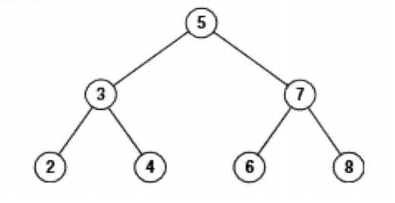

#  题目描述

给定一棵二叉搜索树，请找出其中的第k小的结点。例如， （5，3，7，2，4，6，8）    中，按结点数值大小顺序第三小结点的值为4。



#  思路解析

> 中序遍历二叉搜索树 结果为 2345678  正好为从小到大排序
>
> 找到第 K 小的节点，只需中序遍历第 K 次

#  代码展示
```java
/*
public class TreeNode {
    int val = 0;
    TreeNode left = null;
    TreeNode right = null;

    public TreeNode(int val) {
        this.val = val;

    }

}
*/
//递归写法
public class Solution {
    int index = 0; 
    TreeNode KthNode(TreeNode root, int k)
    {
         if(root != null){ 
            TreeNode node = KthNode(root.left,k);
            if(node != null)
                return node;
            index ++;
            if(index == k)
                return root;
            node = KthNode(root.right,k);
            if(node != null)
                return node;
        }
        return null;
    }

  

}

//非递归写法


```

