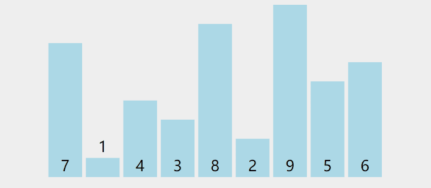

#  算法思想


 > 1. 通过相邻两个数的循环比较，将n个数中最大/小的数一点一点推向一端，再进行下一轮的比较，即将剩余的n-1个数中最大/小的数一点一点推向一端
 > 2. 以此类推，经过固定的n-1轮后使其有序。 

#  动图演示



#  代码实现

```java
// 冒泡排序
public  class  Sort {                               
  public void bubbleSort(int[] arr){                
    for (int i = 0; i < arr.length - 1; i++) {
        for (int j = 0; j < arr.length-1-i; j++) {         
            if(arr[j] > arr[j + 1]) {                      
                arr[j] = arr[j] ^ arr[j + 1];              
                arr[j + 1] = arr[j] ^ arr[j + 1];          
                arr[j] = arr[j] ^ arr[j + 1];    
                flag = false;  	
            }                                              
        }
    }                                                      
 } 
} 

```

# 算法优化
如果进行一次遍历后，发现没有元素进行交换，那么剩余数组
即为有序数组，此时算法依然会执行完余下的遍历

解决办法：设置一个交换标识，如果一次遍历结束未发生交换，则退出循环。

# 优化代码


```java
// 冒泡排序
                                
  public void bubbleSort(int[] arr) {                
    for (int i = 0; i < arr.length - 1; i++) {  
        // 设置交换标识
        Boolean flag = true; 
        for (int j = 0; j < arr.length-1-i; j++) {         
            if (arr[j] > arr[j + 1]) {                      
                arr[j] = arr[j] ^ arr[j + 1];              
                arr[j + 1] = arr[j] ^ arr[j + 1];          
                arr[j] = arr[j] ^ arr[j + 1];    
                flag = false;  	
            }                                              
        }
        // 如果没发生数组元素交换    说明剩余数组有序 退出循环
        if (flag == true) {      
          break;           
       }                       
    }                                                      
 }  

```

#  复杂度
时间复杂度 ： O（n^2） 嵌套 n 次循环  

空间复杂度 ： O（n）       只需要一个临时变量

#  稳定性
如果两个元素大小相同则不会发生交换  即算法稳定
