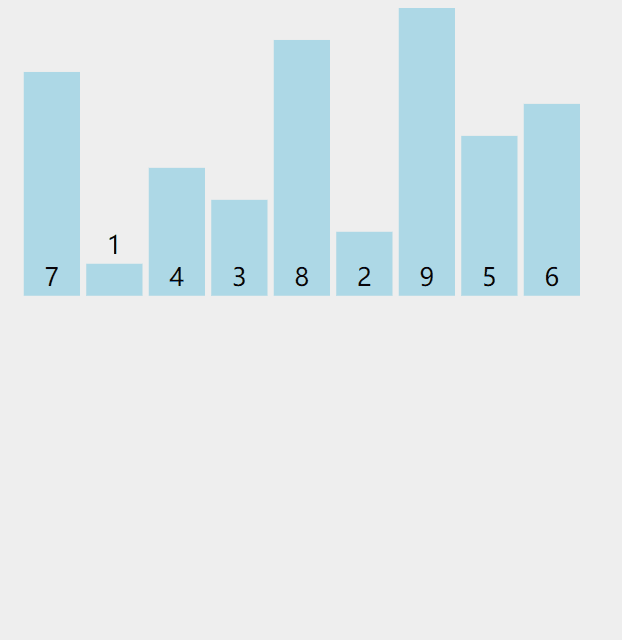

#  算法思想

归并算法利用了“分治”的思想,对`若干个有序集合`进行排序

“分” ：将所求集合一直二分，直至分到比较的最小单元，即一个集合中只有一个元素，那么这个集合就是有序的

“治” ：对各个有序集合进行排序    例如合并两个有序数组，创建一个和两个数组大小之和的临时数组，比较两个数组元素，将较小值按顺序加入临时数组，重复此步骤，直到全部排序完成。如果一个数组已经全部插入临时数组，此时直接将另一个数组插入临时数组。

1. 无限二分到每个集合只剩一个元素
2. 两两合并进行比较，利用临时数组存储

#  动图演示



#  代码实现

```java
// 归并排序
public class MergeSort {
    //拆分到最小单元
    public static void sort(int[] arr, int low, int high){
        int mid = (low + high) / 2;
        if (high > low ) {
            sort(arr, low, mid);
            sort(arr, mid + 1, high);
            merge(arr, low, mid, high);
        }
    }
    //从最小单元开始合并
    public static void merge(int[] arr, int low, int mid, int high) {
        int[] temp = new int[high - low + 1];
        int left = low;
        int right = mid + 1;
        int k = 0;
        while (left <= mid && right <= high) {
            if (arr[left] < arr[right]) {
                temp[k++] = arr[left++];
            } else {
                temp[k++] = arr[right++];
            }
        }
        //考虑 其中一个数组已经完成插入
        while (left <= mid) {
            temp[k++] = arr[left++];
        }
        while (right <= high) {
            temp[k++] = arr[right++];
        }
        //用临时数组 按位置替换原数组
        for (int k2 = 0; k2 < temp.length; k2++) {
            arr[k2 + low] = temp[k2];
        }
    }

    public static void main(String[] args) {
        int[] arr =new int[]{8,7,6,5,4,3,2,1};
        sort(arr,0,arr.length - 1);
        System.out.print(Arrays.toString(arr));
    }

}
```

#  复杂度

时间复杂度：O(nlogn)   最好情况，最坏情况，平均情况下复杂度一致
空间复杂度：O(n)     最后一次合并需要整个数组长度（n）大小的临时数组，在 n 比较大的时候，可能会内存溢出


#  稳定性

稳定