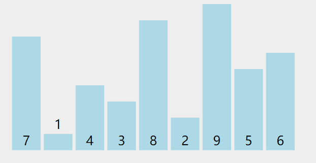

#  算法思想

选定一个标准数，将大于标准数的全部排在右边，小于的排在左边，然后对左右两边重复此操作，当数组两侧的长度均小于等于1，那么数组就自然有序了。


#  动图演示


#  代码实现

```java
// 递归方式
    public void quickSort(int[] arr,int start,int end){
          // 递归调用先写结束条件
          if(end > start) {
              return;
          }
              //选取数组第一个值作为标准数
          int target = arr[start];
          int i = start;
          int j = end;
           while(i < j){
               while(i < j && arr[j] >= target){
                   j--;
               }
               if(i < j){
                   arr[i] = arr[j];
               }
               while(i < j && arr[i] <= target){
                   i++;
               }
               if(i < j){
                   arr[j] = arr[i];
               }
           }
              //将target赋值给指针最后一位    
              arr[i] = target;
              //递归调用 
              quickSort(arr, start, i - 1);
              quickSort(arr, i + 1, end);
        }
    }

```
```java
//非递归方式
```

#  算法优化

1. 选取第一个数作为标准书数字不是最优解法，如果待排数组是有序的则需要递归 n-1 次
2. 快排在数据量较小时性能并不比其他算法好，在待排序列为10左右时，可以采用插入排序进行排序。
3. 在一次分割结束后，可以把与Key相等的元素聚在一起，继续下次分割时，不用再对与key相等元素分割

#  优化代码

略

#  复杂度
时间复杂度：平均O(nlogn)，最坏O(n2)，实际上大多数情况下小于O(nlogn)
由于考虑理想情况 每次Partition排序后标准数在中间 递归是需要 log2n 次  每次遍历所有元素 n   即 O(nlog2n)
最坏情况 递归n-1次 （n-1）+（n-2）+...+ 1 =  n（n-1）/2   即 O（n^2）
推导如下： 
T（n）≤2T（n/2） +n，T（1）=0  
T（n）≤2（2T（n/4）+n/2） +n=4T（n/4）+2n  
T（n）≤4（2T（n/8）+n/4） +2n=8T（n/8）+3n  
……  
T（n）≤nT（1）+（log2n）×n= O(nlogn) 
递归结束条件   n/x = 1


空间复杂度:O(logn)（递归调用消耗）

#  稳定性
不稳定