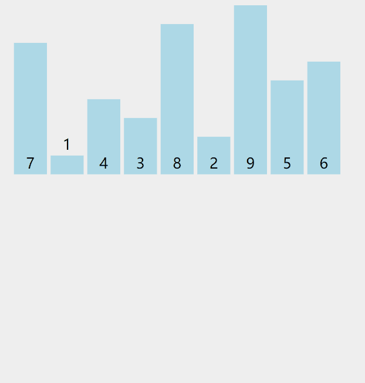

#  算法思想

1. 插入排序将待排数组看成左侧 `有序` 和右侧 `无序` 两部分
2. 将无序部分元素一个个插入到有序部分，从后往前进行交换，直到插入合适的位置

#  动图演示



#  代码实现

```java
//插入排序
    public void insSort(int[] arr) {
       for (int i = 1; i < arr.length; i++) {
           for (int j = i; j >= 1; j--) {
               if (arr[j] < arr[j - 1]) {
                   int temp = arr[j];
                   arr[j] = arr[j - 1];
                   arr[j - 1] = temp;
               }else {
                   break;
               }
           }
       }
    }
```

#  算法优化

``_``_``插入元素时的按顺序比较变为二分查找比较


#  优化代码

#  复杂度

时间复杂度：O(n^2)

空间复杂度：O(1)

tips：如果数组本身有序度越高，那么插入排序的内层循环只需要比较、移动较少次，因此插入排序更适合数列近似有序的情况，但是由于其时间复杂度不太好，因此很少被单独使用。

#  稳定性

相同元素不会发生交换  稳定