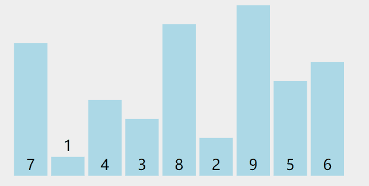

#  算法思想

> 1. 循环一次数组，找到数组中最小的元素将其排在首位，再次循环剩余数组，找到数组中最小的元素将其排在第二位
> 2. 以此类推，经过固定的n-1轮后使其有序。   

#  动图演示



#  代码实现
```java
    public void bubbleSort(int[] arr){          
        for (int i = 0; i < arr.length - 1; i++) {
           int min = i;
           for(int j = i + 1; j < arr.length; j++) {
                if (arr[min] > arr[j] ) {
                    min = j;
                }
               }
            if (min != i) {
               int temp = arr[i];
               arr[i] = arr[min];
               arr[min] = temp;
            }
        }
    }
```

# 算法优化

选择排序和冒泡排序有些类似，但是比较大小时不需要一个一个交换，所以选择排序性能上是优于冒泡排序的
优化方法：每次循环同时找出最大最小的元素分别于首位元素交换，此时外层循环时间缩短一半

# 优化代码

```java
    public void bubbleSort(int[] arr){       
        for (int i = 0; i < (arr.length)/2; i++ ) {
            int min = i;
            int max = arr.length - 1 - i;
            int temp;
            if (arr[min] > arr[max]) {
                 min = arr.length - 1 - i;
                 max = i;
            }
            for (int j = i + 1; j < arr.length - i -1; j++) {
                if (arr[j] < arr[min]) {
                    min = j;
                }else if (arr[j] > arr[max] ) {
                    max = j;
                }
            }
            if(i != min) {
                temp = arr[i];
                arr[i] = arr[min];
                arr[min] = temp;
                // 如果最后只剩三个元素 [3,1,2]  交换最小值会污染最大值的下标
                if (i == max) {
                    max = min;
                }
            }
            temp = arr[arr.length - 1 - i];
            arr[arr.length - 1 - i] = arr[max];
            arr[max] = temp;
        }
    }
```

# 复杂度

时间复杂度：O（n^2）

空间复杂度：O（1）

# 稳定性

不稳定
例如{3,3,1}，第一次循环  1 3 交换，第一个 3 交换到第二个 3 后面  